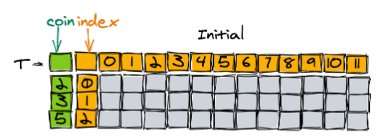

# Coin Change

This is the classic challenge to make an exact amount of change using the fewest number of coins, when you're given the different coin values ahead of time.  Now that I'm getting into non-trivial dynamic programming problems, it's becoming a challenge to write clear code that expresses its intent.  So my motivation for this challenge is to see if Rust's syntax and idioms can make dynamic programming a bit easier to read and write.

## `enumerate()` all the things

`enumerate()` is really useful in this setting.  It wraps an iterator of some value and returns it along with a running index counting up from zero. This helps bridge the gap back and forth between a table coordinate index and what that index actually represents. For example, the outermost loop ranges over the different coin denominations we were given:

```rust
for (c, coin) in coins.into_iter().enumerate() {...}
```

In this case they're different numbers. The `c` is the row index into the table (`0,1,2...`), where `coin` is the actual value of the coin (`2,3,5`), as shown in this graphic from [1]:



This lets us use the right variable in the right context:

```rust
if amount % coin == 0 {
    table[c][a] = Count(amount / coin);
}
```

And we know they're always paired up correctly because it's done for us in the call to `enumerate()`.

Within each coin value, we then range across the possible amounts, up to the full `amount` specified in the input:

```rust
for (a, amount) in (0..=amount).enumerate() {...}
```

In this case the two numbers resulting from `enumerate()` will match, but we still use them according to their context:

```rust
// making amount 0 takes 0 of this coin denomination
if amount == 0 {
    table[c][a] = Count(0);
    continue
}
```

I've moved some important logic into a separate function `candidate_indexes(coin, amount)` that returns an iterator, so in the calling code it can be used in a `for` loop. This is the step that decides which other table cells to look at when computing the current table cell. Separating into a function like this also emphasizes that deciding which sub-problems to visit is dependent purely on the `coin` denomination and the `amount` we're considering.

```rust
fn candidate_indexes(coin  : i32,
                     amount: i32) -> impl Iterator<Item=(usize,i32)>
{
    let max_coins = amount / coin;

    (0..=max_coins)
        .map(move |k| ((amount - k*coin) as usize, k))
}
```

The `move` keyword in the call to `map` moves ownership of the `coin` and `amount` variables into the closure. The function owned them up to that point, but it's about to go out of scope, so `move` passes them to the closure.

This all comes together in the innermost code:

```rust
// the general step, where the bulk of the computation takes place.
// consider taking more and more of this coin denomination
for (a, k) in candidate_indexes(coin, amount) {
    let coin_count = table[c-1][a] + Count(k);
    candidates.push(coin_count);
}

let optimal = candidates.into_iter()
                        .min().unwrap();

table[c][a] = optimal;
```

Finally we project out the answer, which is the bottom-right table cell, converting to the format the solution checker expects:

```rust
match table[coin_count-1][amount as usize] {
    Count(count) => count,
    Infinity     => -1
}
```

Note we had to compute `coin_count = coins.len()` and keep it around because we're consuming the `coins` input vector in the main for loop (note it uses `into_iter()`). We couldn't write `table[coins.len()-1]` afterwards because `coins` is gone by that point.  In my view this actually adds to the expressivity of the code; it tells the reader we're only going through the list of coin denominations once--we might as well take ownership of the values as we go.


## Condensed

Just the `for` loop structure of the recursive case (base cases omitted), innermost recursive selections/update, and final result projection:

```rust
fn coin_change(coins : Vec<i32>,
               amount: i32) -> i32
{
    for (c, coin) in coins.into_iter().enumerate() {
    for (a, amount) in (0..=amount).enumerate() {
        for (a, k) in candidate_indexes(coin, amount) {
            let coin_count = table[c-1][a] + Count(k);
            candidates.push(coin_count);
        }
        table[c][a] = optimal(candidates);
    }}
    table[coins.len()-1][amount as usize]
}
```


## Complexity

Time complexity is cubic I think, $O(ca^2)$ because at each `M[c][a]` we do $O(a)$ queries of the table.
Space complexity is $O(ca)$


## References

[1] https://algodaily.com/challenges/the-coin-change-problem
