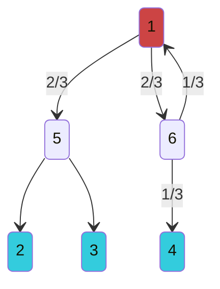
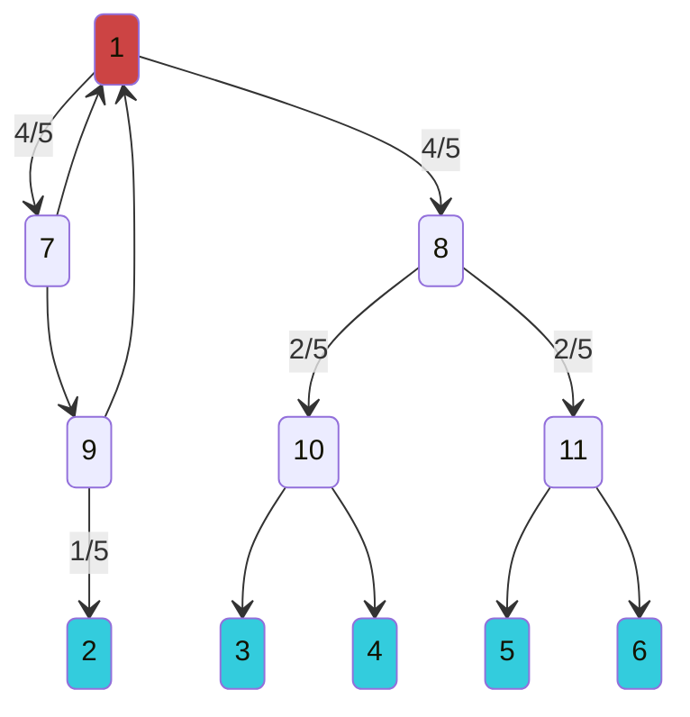
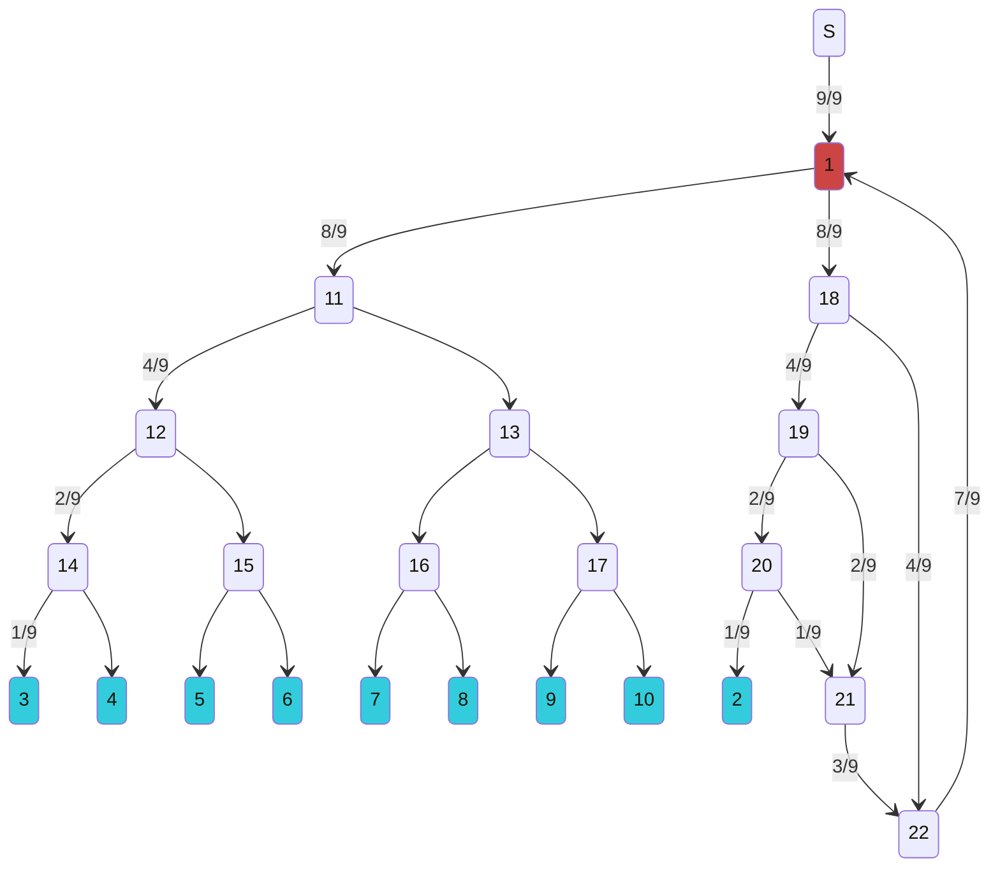

# $f(n) = \frac{1}{2^n+1}$

---
## 1 source to 3 customers

$$f(1) = \frac{1}{3}$$

## 1 source to 5 customers

$$f(2) = \frac{1}{5}$$

## 1 source to 9 customers

$$f(3) = \frac{1}{9}$$

## Observations

- Two subgraphs, one a 2-ary tree rooted at 11 containing $2^n$ leaves, the other a cyclic graph with 1 leaf (customer) that gathers and carries back to 1 all the excess supply