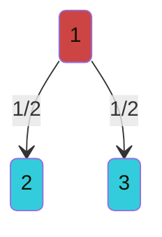
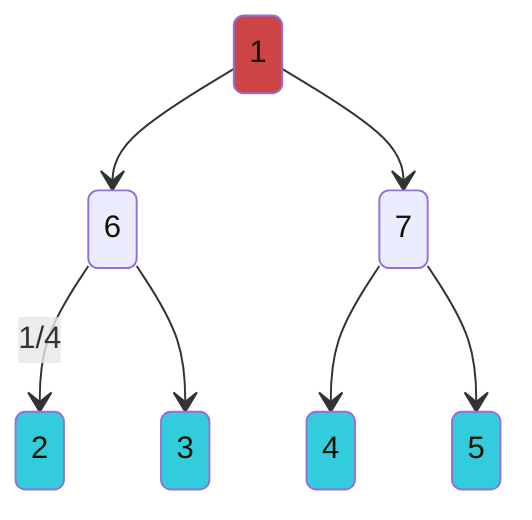
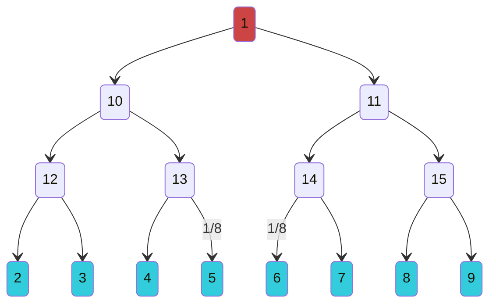

# $f(n) = \frac{1}{2^n}$

---
## (n = 1) 1 source to 2 customers

## n = 2

## n = 3

Formula for number of pipes:

$$E(n) = \sum_{i=1}^n 2^i$$

Formula for number of joints (including source/customers):

$$\begin{align}
	V(n) &= 1 + \sum_{i=1}^{n-1} 2^i + 2^n \\
	     &= \sum_{i=0}^n 2^i
\end{align}$$
