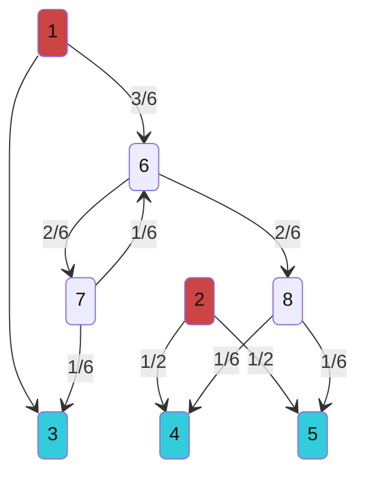

## 2 sources to 3 customers

```mermaid
stateDiagram-v2
	2 --> 4: 1/2
	2 --> 5: 1/2
	1 --> 3
	1 --> 6: 3/6
	6 --> 8: 2/6
	6 --> 7: 2/6
	8 --> 4: 1/6
	8 --> 5: 1/6
	7 --> 3: 1/6
	7 --> 6: 1/6

	classDef source fill:#C44
	classDef sink fill:#3CD
	class 1 source
	class 2 source
	class 3 sink
	class 4 sink
	class 5 sink
```
