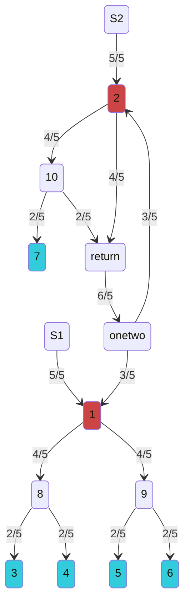
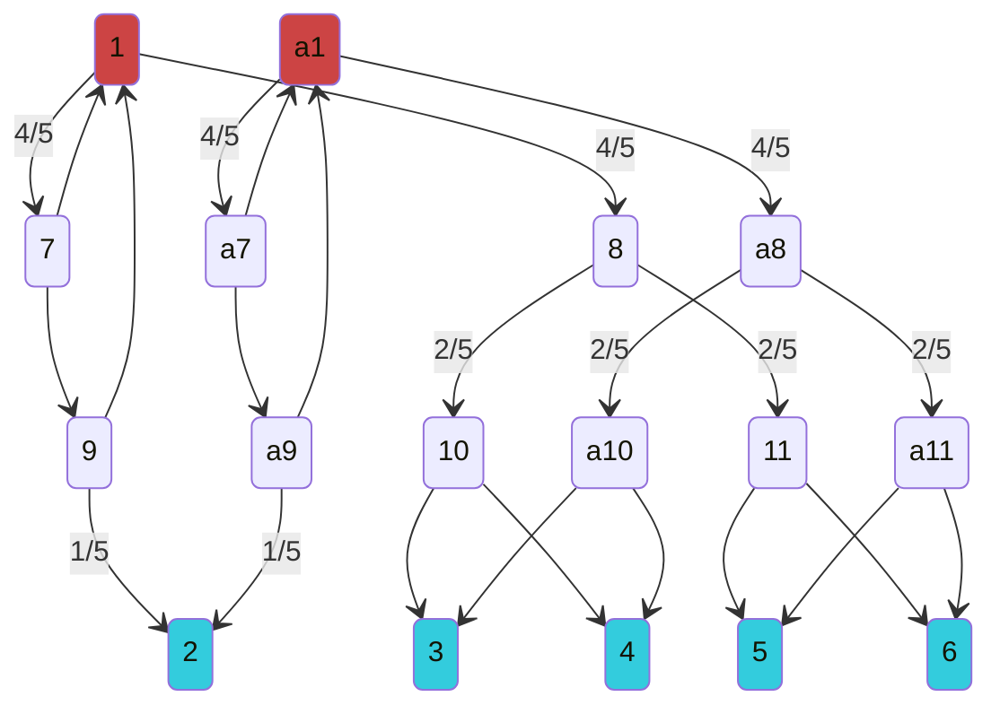

## 2 sources to 5 customers
- 15 edges (probably optimal)
- first time seeing a source feed another source

## 1 source to 5 customers 2 times ($2\times\frac{1}{5}$)
- 24 edges (interesting idea but not optimal)

