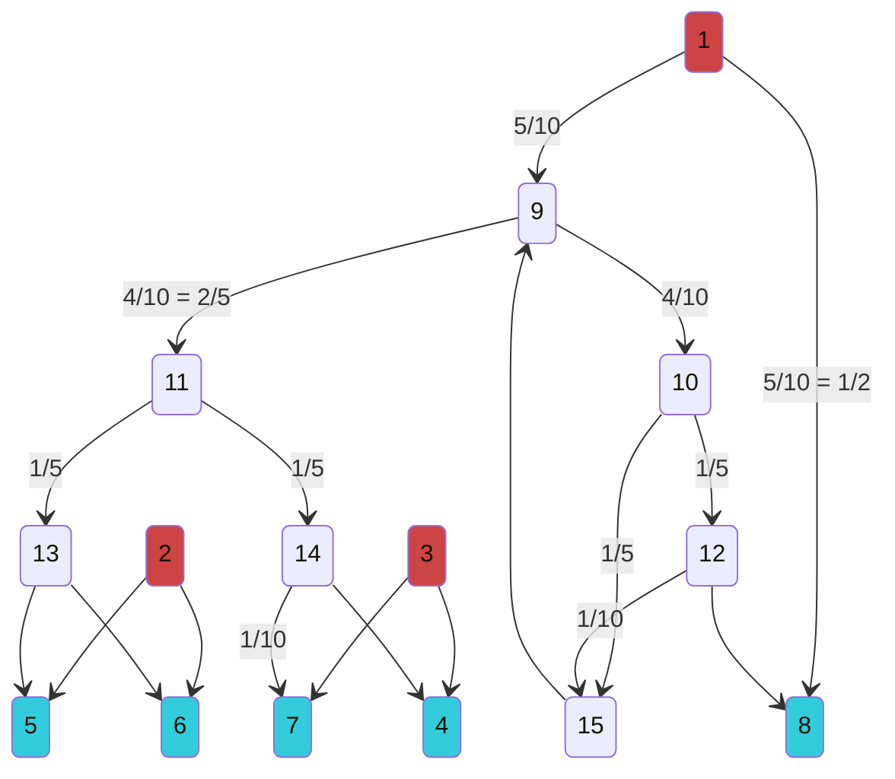

## 3 sources to 5 customers

## Name the subgraphs

- the edge from 9 to 11: ---
- the paths from 11 to the leaves: ---
- the vertices $\{9,10,12,15\}$ (contains cycles): ---
- the "full joint" vertex 9: ---