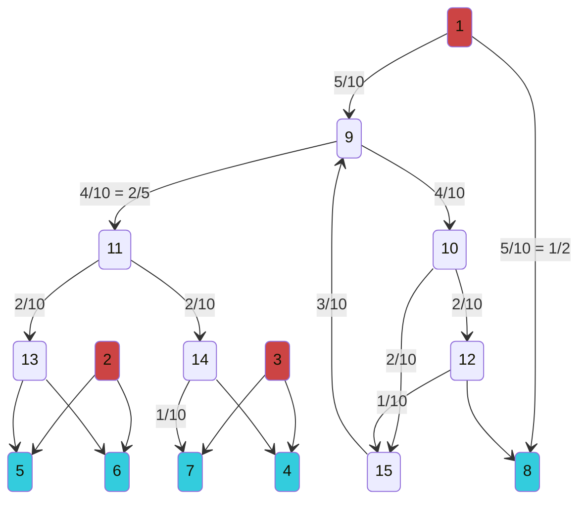

## 3 sources to 5 customers

```mermaid
stateDiagram-v2
	1 --> 9: 5/10
	1 --> 8: 5/10 = 1/2
	3 --> 7
	3 --> 4
	2 --> 5
	2 --> 6
	9 --> 10: 4/10
	9 --> 11: 4/10 = 2/5
	10 --> 12: 2/10
	10 --> 15: 2/10
	11 --> 13: 2/10
	11 --> 14: 2/10
	12 --> 15: 1/10
	12 --> 8
	13 --> 5
	13 --> 6
	14 --> 7: 1/10
	14 --> 4
	15 --> 9: 3/10

	classDef source fill:#C44
	classDef sink fill:#3CD
	class 1 source
	class 2 source
	class 3 source
	class 4 sink
	class 5 sink
	class 6 sink
	class 7 sink
	class 8 sink
```
