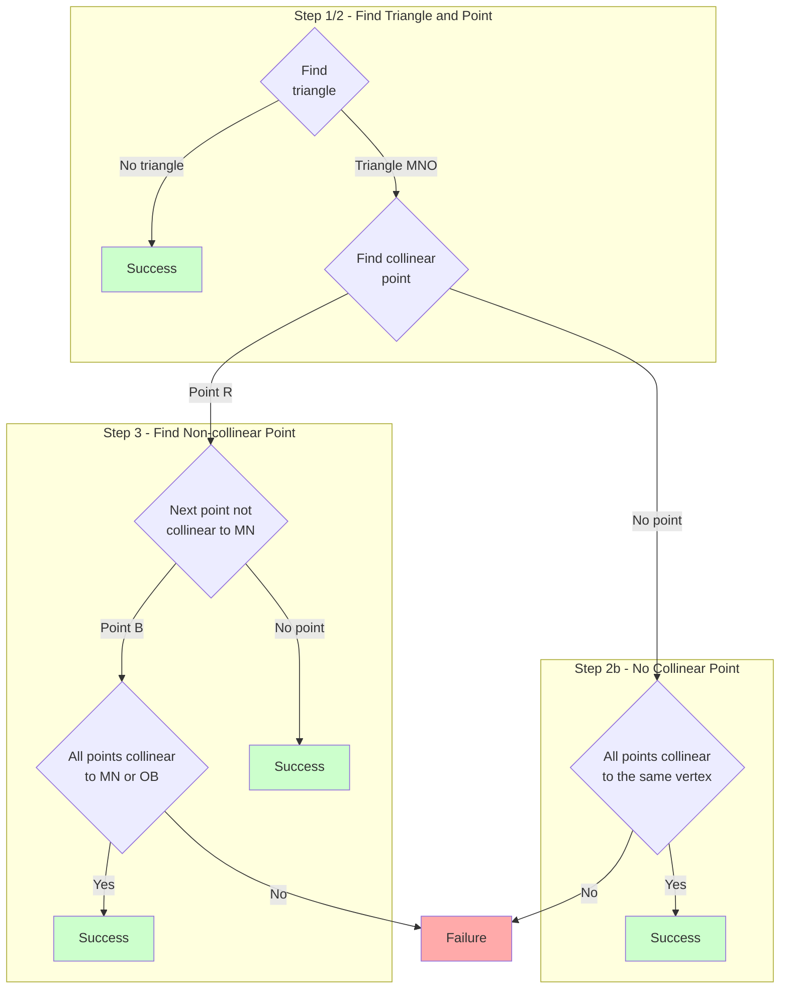

# Target Practice

This challenge involves some geometric deductive reasoning, using points, lines and a triangle. The solution below runs in 0.01s in Rust, which is fast enough to join a 4-way tie for 1st place with the C++ solutions.

## Visualization

To get a visual sense of what's going on, let's render **Sample Input 2** using [Desmos](https://www.desmos.com/calculator/) and draw the obvious lines through it:


This test case is a successful one because with at most two lines drawn (red and blue) we have crossed through all the points in the data set.

Compare this to **Sample Input 1**, where we would need at least three lines to cross all points:


Try drawing one line through the remaining blue points!


## Algorithm

**Summary**: Iterate over points until we have a triangle. Pick a fourth point, $R$. In the success case this point must be collinear with one of the sides $MN$ of the triangle. Then every other point must be collinear with side $MN$ or the line from a new point $B$ (which is not collinear with $MN$) to vertex $O$ of the triangle, the one not belonging to side $MN$. If so, it's a success case, otherwise a failure.


### Notes

It took a bit of thinking to figure out the above algorithm. Here are some notes I took during my brainstorming:

- In the success case, there are at most two lines that together pass through all points.  Meaning if you have any 3 points, 2 are on one of the lines and 1 is on the other, or all 3 are on one line
- Said differently: any three points that don't form a line actually form a triangle. In the success case at least one of the sides of the triangle is on one of the lines

## General Case

Let's consider the general case by choosing a specific one that we know (by construction with two list comprehensions) can be covered by only two lines.

So we'll need two lines' worth of data for a test graph:

```bash
$ docker run --rm -it haskell
````

```haskell
ghci> [ (x, (-1)*x+3) | x <- [-5..5], odd x ]
[(-5,8),(-3,6),(-1,4),(1,2),(3,0),(5,-2)]

ghci> [ (x, 2*x-1) | x <- [-3..5], odd x ]
[(-3,-7),(-1,-3),(1,1),(3,5),(5,9)]
```

Paste the points into Desmos and toggle lines:


Let's go through the five steps of our algorithm:

### Step 1 - Form Triangle

The algorithm is general enough to start with any two arbitrary points. Suppose they are the following two points on the red line, shown by the purple line segment connecting them:


Next, find the first point that is not collinear to this line. If we don't find one, we're done and we have a successful case, because all points are on a single line that can be drawn through them all.

The more interesting case is when we do have a point not on our original line, thus forming a triangle:


### Step 2 - Find Collinear Point

Next, find a point collinear with any one of the sides of the triangle. If there isn't one, go to Step 2b.

Say we did find a point $R$ (for red). The side the point is collinear with is identified as $MN$, and the other vertex of the triangle we identify as point $O$, as below:


### Step 2b - No Collinear Point

If none of the remaining points are collinear to a triangle edge, it can still be a success case if the non-triangle points are all collinear to one of the triangle's vertices. This can be seen in the above image if you imagine the only two red points are the triangle vertices M and N.

### Step 3 - Find Non-collinear Point

If there are any points left that aren't on the $MN$ line (the line containing the side $MN$), they had better all be on a line containing point $O$. So find the first unaccounted-for point that is not on the line $MN$ and call it $B$ (for blue). Suppose it happens to be the one circled in blue below:


Now all points should be accounted for by our lines $MN$ and $OB$, so if we find even one point not on one of these two lines, it's a failure case. Otherwise, we've found the two lines and it's a success case!

## Pseudocode

Here's pseudocode for the above algorithm:

```pseudo
form triangle T

loop
    R <- next point
until R is collinear with side MN of triangle T

if R
    O <- the point of triangle T other than M and N

    loop
      B <- next point
    until B not collinear with MN

    all points are collinear with MN or OB
else
    all non-triangle points are collinear with a triangle point
end
```

## Flowchart

This is a [mermaid flowchart](https://mermaid-js.github.io/mermaid/#/flowchart) of the fixed algorithm:




## Incorrect

The initial attempt at this algorithm was not correct, I found a successful test case that the code nonetheless reports as a failure. It's surprising that it got past the kattis tests; there are 26 of them for this challenge, and usually the tests are pretty thoroughly thought out to catch corner cases. This isn't even a complicated test case, here's it is:


The points are given to the code starting with the bottom left, then bottom right. So the bottom two are picked as $a$ and $b$ by the code to form the triangle $abc$ with the top left point (triangle $MNO$ in the above image). The second step in the algorithm looks for a point collinear to a side of the triangle, but it doesn't find one and therefore concludes the points cannot be covered with two lines, though clearly they can, shown by the red and blue lines in the example above.

### Fix

The fix for this was straightforward. If there are no points collinear to MNO, it can still be a successful test case as long as all the remaining points form a line and the line includes one of the vertices of the triangle. The runtime is still 0.01s so we are still tied for first. I will reach out to the kattis team in case they want to add my new test case and re-run the submissions.

#### Sample Input 3

My code initially failed on the following input until I found the fix:

```text
5
0 0
1 0
0 1
1 1
2 1
```
