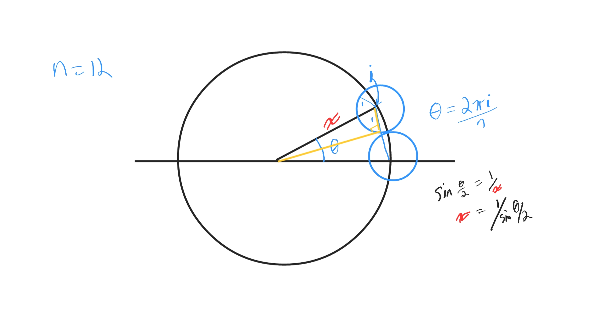
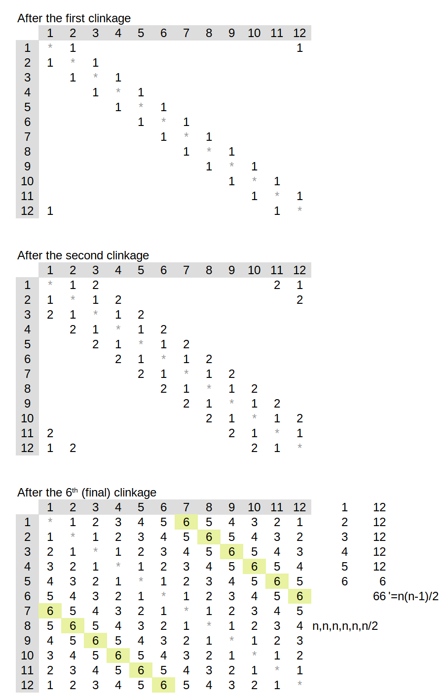
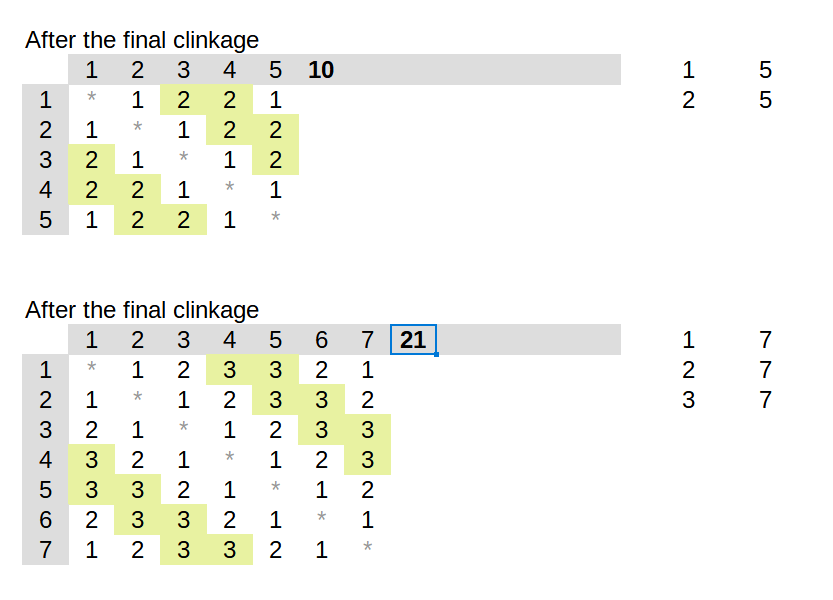

# Toast

|     |                                   |
| --- | --------------------------------- |
| $N$ | Number of people around the table |
| $D$ | Length of their arms              |
| $T$ | Total number of clinks            |
|     |                                   |

- $2 \le N \le 10^4$
- $100 \le D \le 10^9$
- $1 \le T \le 10^8$

If the table is small enough, everyone is in reach of everyone else, so we'll hear $N(N-1)/2$ clinks total, by the common formula for "number of unique handshakes at a party, nobody shakes their own hand."  But the table could also be so big that nobody can reach anybody else, where the number of clinks will be 0.

### Thought experiment

Start the table so large that nobody can reach anybody else. Reduce the table radius gradually until everybody can suddenly clink with the person next to them. This enables a total of $N$ clinks: I clink to the right, that person clinks to the right, all the way around until the person to my left clinks to me. This is the "first clink". The clink with my counter-clockwise neighbour, and the table radius I would need to first achieve it, is modeled in the following diagram:

As the radius goes to 0 we will obviously end up with everybody clinking together and we get the $N(N-1)/2$ formula at that point. But it gets interesting between the two extremes. From our perspective at the table (say, the right-most seat, as in the diagram), at "first clink" we will be able to reach the 1st person to our right and 1st person to our left. As the table shrinks, we will next find ourselves in reach of the 2nd person to our right and the 2nd person to our left at the same time.  The person at the exact opposite end of the table (if N is even) is still the *most* out of reach, but that person's two neighbours are *slightly* closer to us than the opposite person, but still out of reach. Since we picked an arbitrary person's perspective, this applies equally to every person at the table, which is why we add `+= people` at each step instead of just 1.

The table continues to shrink and we have N clinks at each new encounter with the next farthest neighbour, until the table is small enough for everybody to clink with everyone else.  If the number of people is even, our final clink is actually N/2 because we're not clinking to the left and right at the same time, just directly opposite us at the table. Because two people make one clink, we have to divide by 2.

## Binary Search

But wait! We chose this problem because it was on [Brent's blog about binary search](https://byorgey.wordpress.com/2023/01/01/competitive-programming-in-haskell-better-binary-search/#challenges). Where is the binary search?

An alternate way to do this could be a function that takes an arbitrary N and D, and simulates, for an arbitrary person, how many clinks that person gets by calculating circle overlaps as we increase the angle counter-clockwise around the table given that fixed radius, dividing out overlaps accordingly so we don't overcount. Then we would zero in on the target radius using a binary search on the table radius.  This would not rely on our accruing a running total of clinks and searching through our tally as we do above, but a *log n* zeroing-in on the extremes of the radius. This would have a bit of difficulty because the predicate goes from `false` to `true` but then back to `false` again for a given T. It will be interesting to see how Brent did this if he publishes a follow-up post about it.

**Update**: I missed that the binary search is on the number of clinks, not the table radiuses. I was using the built-in `Vec::position` function, which is $O(n)$, for this last step. Swapping it with Brent's `search`  function brings this step down to $O(\log n)$. The complexity of the algorithm I described in the paragraph above is greater than both of these, because for each $O(\log n)$ measurement of clinks at a given table radius T we would have to render and check the overlap of $O(n)$ neighbours, for an overall time complexity of $O(n \log n)$.  My original method with the `position` call considered all the angles first, one for each neighbour, then another search through every tier to find the clink count, for a complexity of $O(n + n)$. The new method does the initial angle checks, but now uses binary search for the last step, for a time complexity of $O(n + \log n)$ which is the best of the three.

## Initial Modeling

In my initial modeling of the problem, I used LibreOffice Calc to render the person relationships in a NxN grid format just to make everything easier to think about. As the radius reduces, a whole set of people can suddenly reach each other, and they all have the same "clinkage" number. This ended up manually confirming that what I was considering was the handshake formula $n(n-1)/2$. Here's a screenshot of my initial modeling, showing at which clinkage number each pair of people are able to clink glasses (grey asterisks because a person cannot clink with themselves):

### Even N

### Odd N

### Interactive Graph

To visualize neighbours converging toward and over each other, I used Desmos to plot 4 people at a table up to 2 in radius:

Interactive graph: https://www.desmos.com/calculator/yfdy2vtcfe

There's a slider on the left that starts at 2 and can be adjusted to show the neighbours' spheres of influence approaching and overlapping.
